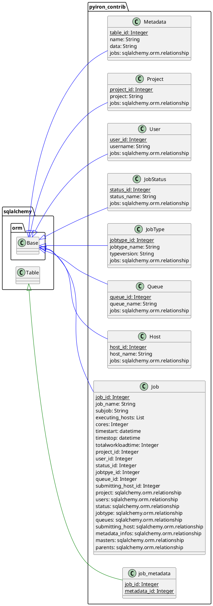

Classes are derived from sqlalchemy.orm class `Base` for common tables or initiated by sqlalchemy class `Table` for m:n relation tables.

```plantuml
@startuml

left to right direction
skinparam ranksep 150

package "sqlalchemy" {
    package "orm" {
        class Base
    }
    class Table
}

package "pyiron_contrib" {
    class Project {
        {static} project_id: Integer
        project: String
        jobs: sqlalchemy.orm.relationship
    }

    class User {
        {static} user_id: Integer
        username: String
        jobs: sqlalchemy.orm.relationship
    }

    class JobStatus {
        {static} status_id: Integer
        status_name: String
        jobs: sqlalchemy.orm.relationship
    }

    class JobType {
        {static} jobtype_id: Integer
        jobtype_name: String
        typeversion: String
        jobs: sqlalchemy.orm.relationship
    }

    class Queue {
        {static} queue_id: Integer
        queue_name: String
        jobs: sqlalchemy.orm.relationship
    }

    class Host {
        {static} host_id: Integer
        host_name: String
        jobs: sqlalchemy.orm.relationship
    }

    class Job {
        {static} job_id: Integer
        job_name: String
        subjob: String
        executing_hosts: List
        cores: Integer
        timestart: datetime
        timestop: datetime
        totalworkloadtime: Integer
        project_id: Integer
        user_id: Integer
        status_id: Integer
        jobtpye_id: Integer
        queue_id: Integer
        submitting_host_id: Integer
        project: sqlalchemy.orm.relationship
        users: sqlalchemy.orm.relationship
        status: sqlalchemy.orm.relationship
        jobtype: sqlalchemy.orm.relationship
        queues: sqlalchemy.orm.relationship
        submitting_host: sqlalchemy.orm.relationship
        metadata_infos: sqlalchemy.orm.relationship
        masters: sqlalchemy.orm.relationship
        parents: sqlalchemy.orm.relationship
    }

    class job_metadata {
        {static} job_id: Integer
        {static} metadata_id: Integer
    }

    class Metadata{
        {static} table_id: Integer
        name: String
        data: String
        jobs: sqlalchemy.orm.relationship
    }
}


Base <|-[#blue]- Project
Base <|-[#blue]- User
Base <|-[#blue]- JobStatus
Base <|-[#blue]- JobType
Base <|-[#blue]- Queue
Base <|-[#blue]- Host
Base <|-[#blue]- Job
Base <|-[#blue]- Metadata
Table <|-[#green]- job_metadata

@enduml
```
