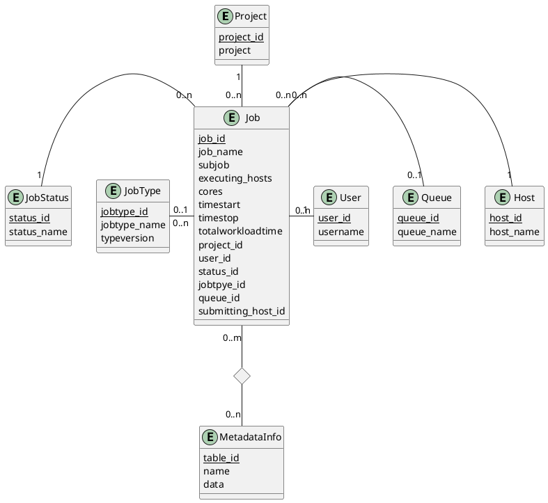

Tables are called `entitis` and tables for implementing m:n relations are `diamonds`.
Generating UML Diagrams with an [PlantUML Editor](https://www.plantuml.mseiche.de/).

```plantuml
@startuml

entity Project {
    {static} project_id
    project
}

entity User {
    {static} user_id
    username
}

entity JobStatus {
    {static} status_id
    status_name
}

entity JobType {
    {static} jobtype_id
    jobtype_name
    typeversion
}

entity Queue {
    {static} queue_id
    queue_name
}

entity Host {
    {static} host_id
    host_name
}

entity Job {
    {static} job_id
    job_name
    subjob
    executing_hosts
    cores
    timestart
    timestop
    totalworkloadtime
    project_id
    user_id
    status_id
    jobtpye_id
    queue_id
    submitting_host_id
}

diamond job_metadata

entity MetadataInfo{
    {static} table_id
    name
    data
}

Project "1" -down- "0..n" Job
Job "0..n" -left- "0..1" JobType
Job "0..n" -right- "1" Host
Job "0..n" -right- "0..1" Queue
Job "0..n" -right- "1" User
Job "0..n" -left- "1" JobStatus
Job "0..m" -down- job_metadata
job_metadata -down- "0..n" MetadataInfo

@enduml
```
