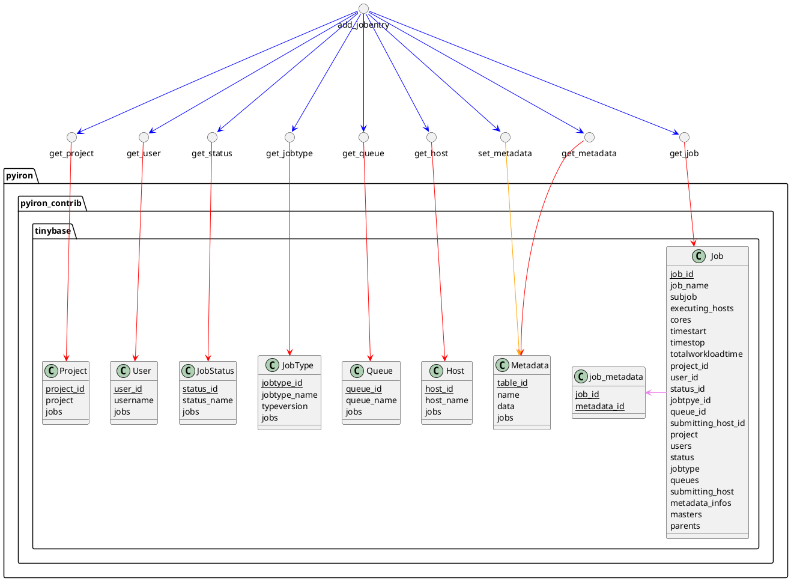

The handling of incoming jobdata is done by the method `add_jobentry`, which forwards the data to the set and get methods related functions.

```plantuml
@startuml

skinparam ranksep 150

package "pyiron" {
    package "pyiron_contrib.tinybase" {
        class Project {
            {static} project_id
            project
            jobs
        }

        class User {
            {static} user_id
            username
            jobs
        }

        class JobStatus {
            {static} status_id
            status_name
            jobs
        }

        class JobType {
            {static} jobtype_id
            jobtype_name
            typeversion
            jobs
        }

        class Queue {
            {static} queue_id
            queue_name
            jobs
        }

        class Host {
            {static} host_id
            host_name
            jobs
        }

        class Job {
            {static} job_id
            job_name
            subjob
            executing_hosts
            cores
            timestart
            timestop
            totalworkloadtime
            project_id
            user_id
            status_id
            jobtpye_id
            queue_id
            submitting_host_id
            project
            users
            status
            jobtype
            queues
            submitting_host
            metadata_infos
            masters
            parents
        }

        class job_metadata {
            {static} job_id
            {static} metadata_id
        }

        class Metadata{
            {static} table_id
            name
            data
            jobs
        }
    }
}


circle get_project
circle get_user
circle get_status
circle get_jobtype
circle get_queue
circle get_host
circle add_jobentry
circle set_metadata
circle get_metadata
circle get_job

add_jobentry -[#blue]-> get_project
add_jobentry -[#blue]-> get_user
add_jobentry -[#blue]-> get_status
add_jobentry -[#blue]-> get_jobtype
add_jobentry -[#blue]-> get_queue
add_jobentry -[#blue]-> get_host
add_jobentry -[#blue]-> get_job
add_jobentry -[#blue]-> set_metadata
add_jobentry -[#blue]-> get_metadata

get_project -[#red]-> Project
get_user -[#red]-> User
get_status -[#red]-> JobStatus
get_jobtype -[#red]-> JobType
get_queue -[#red]-> Queue
get_host -[#red]-> Host
get_metadata -[#red]-> Metadata
set_metadata -[#orange]-> Metadata
get_job -[#red]-> Job

job_metadata <-[#violet] Job

@enduml
```
